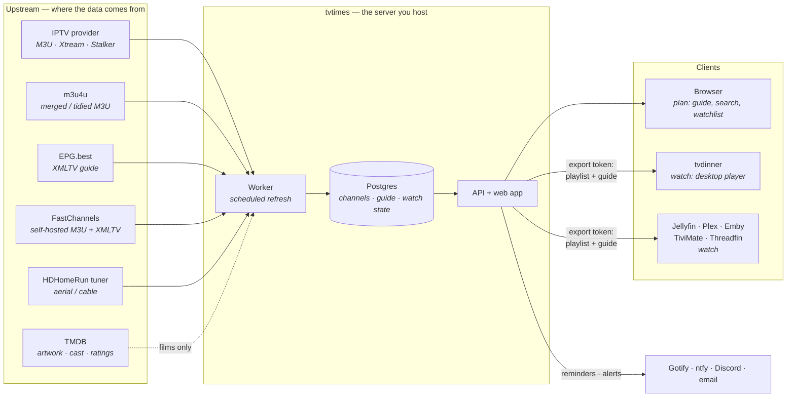
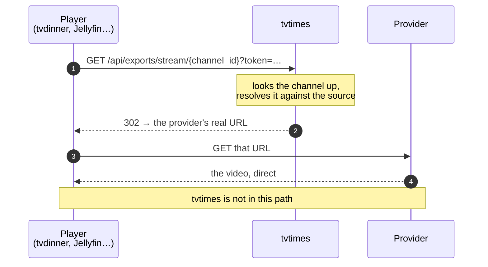
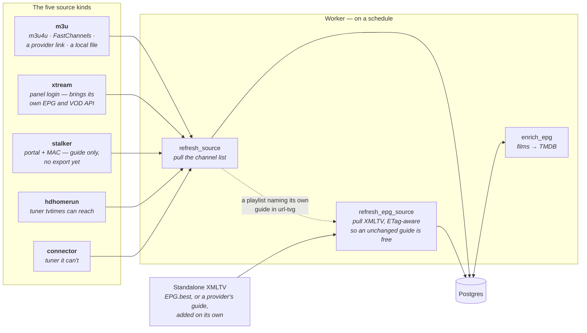
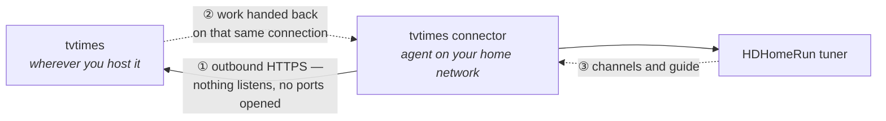
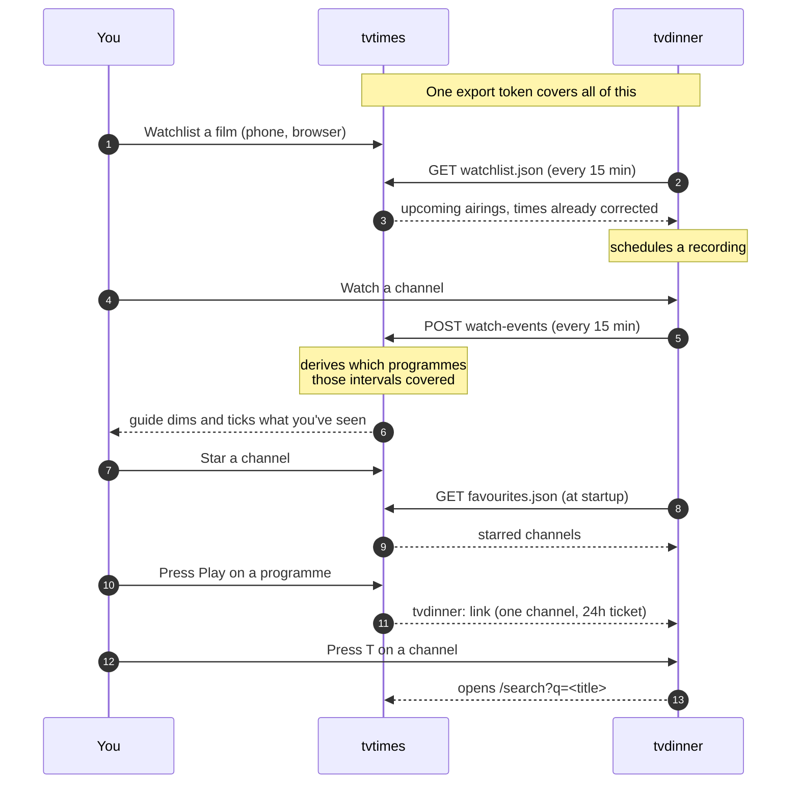
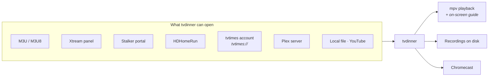

# How the pieces fit

Where your channels and guide data come from, what tvtimes does with them, and
how they reach the thing you actually watch on.

- [The whole path](#the-whole-path) — end to end, in one picture
- [The video never passes through tvtimes](#the-video-never-passes-through-tvtimes) — why the playlist points at us but the bytes don't
- [Getting sources in](#getting-sources-in) — the five source kinds, and the connector
- [How tvtimes and tvdinner cooperate](#how-tvtimes-and-tvdinner-cooperate) — the pairing, and why it's shaped that way
- [tvdinner on its own](#tvdinner-on-its-own) — it doesn't need tvtimes

---

## The whole path

The browser is where you **plan** — tvtimes has no in-browser player, by
design. Playing happens in tvdinner or whichever tuner app you point at the
feeds.

### The video never passes through tvtimes

The playlist tvtimes hands out points every channel back at *itself*, which
looks like proxying. It isn't:

Two consequences worth knowing. Your provider credentials — an Xtream login,
say — **stay on the server** and never appear in a file you hand to a tuner. And
tvtimes needs no bandwidth for playback: it decides *what* you can watch, then
gets out of the way.

---

## Getting sources in

Everything upstream arrives as one of two things: a **playlist** of channels, or
an **XMLTV guide**. A source can carry both — most M3U playlists name their own
guide in a `url-tvg=` attribute — or you can add a guide separately and let
tvtimes match it up.

**The connector** is the odd one out. It's a small agent you run on the network
where the tuner lives, for when tvtimes itself is somewhere else:

The direction of arrow ① is the whole point: the connector dials out, so your
router needs no port forwarding and nothing on your home network is exposed. If
tvtimes is on the *same* network as the tuner you don't need it at all — use a
plain `hdhomerun` source.

Two details that explain most of tvtimes' behaviour:

- **Channels are keyed by tvtimes' own UUID**, not by the upstream `tvg-id`.
  Providers routinely give an East and West feed the same id; keying on our own
  means a programme still links to exactly one channel downstream.
- **Clock correction is applied on the way out**, not stored. A guide that runs
  an hour off gets a per-channel shift, and every export writes times already
  corrected with the right `+ZZZZ` offset — so nothing downstream has to know.

---

## How tvtimes and tvdinner cooperate

tvtimes is where you plan. tvdinner is where you watch. Everything below rides
the **one export token** — there's no second credential and no per-feature
pairing.

### Why it's shaped this way

| Decision | Reason |
|---|---|
| tvdinner reports **intervals**, not "programme X watched" | An EPG re-ingest replaces every programme row. An interval doesn't care, and a clock correction retroactively fixes what counts as watched. |
| Favourites sync is **one-way and additive** | tvdinner stores favourites by name with no record of origin, so a two-way reconcile couldn't tell "removed upstream" from "added here" — and deleting one you set yourself is the worse failure. |
| `T` opens **search**, not the exact guide cell | tvtimes' grid is virtualised, so targeting a cell needs scroll-to-row support. Arriving from a player, finding it by name is what you want anyway. |
| Watchlist recordings are **provenance-marked** | Recordings you scheduled by hand in tvdinner are never touched by the sync. |

### What each credential reaches

| | Reach | Lifetime |
|---|---|---|
| **Export token** | whole line-up, streams, watchlist, favourites; **writes** watch state | until rotated |
| **Play ticket** | one channel and its guide | 24 hours |

`POST /api/exports/watch-events` is the only **write** the export token permits,
and it stays narrow: it appends viewing intervals for channels already on the
account and nothing else.

---

## tvdinner on its own

tvdinner doesn't need tvtimes. It takes the same upstream kinds directly, plus a
few tvtimes has no concept of:

A `tvtimes://` URL is sugar rather than a new protocol: tvdinner expands it back
into the same `playlist.m3u` + `epg.xml` pair, so the guide, favourites,
recording and scheduling all behave exactly as they would for any M3U + XMLTV
source.

---

## See also

- **[This page, rendered](https://issinoho.github.io/tvtimes/architecture/)** — same content, on the website

- [Export feeds](https://github.com/issinoho/tvtimes/wiki/Export-Feeds) — turning the feeds on
- [Pairing with tvdinner](https://github.com/issinoho/tvtimes/wiki/Pairing-With-tvdinner) — the whole pairing, end to end
- [Export API reference](https://issinoho.github.io/tvtimes/api/) — the routes, as OpenAPI
- [Self-hosting guide](homelab.md) — running it
